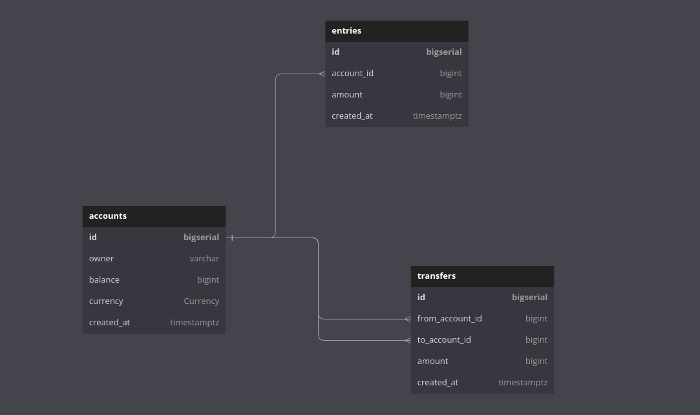

# Golang-gRPC

### for our db schema

--Now u must set up ur container runtime envirment in ur machine

-after this u must download the database image : docker pull postgres:12-alpine
-now u must check it does exists : docker images
-run ur container : docker run --name postgres12 -p 5432:5432 -e POSTGRES_USER=root -e POSTGRES_PASSWORD=pass -d postgres:12-alpine
-run shell inside ythe postgres sql running container : docker exect -it postgres12 psql -U root
